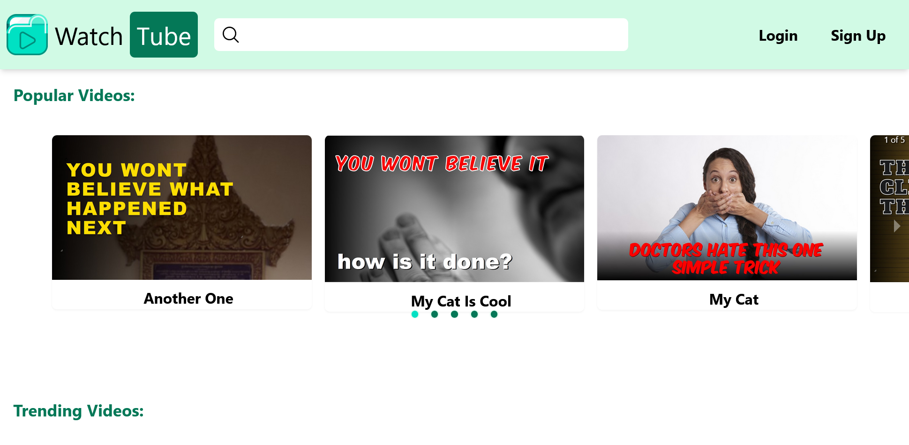
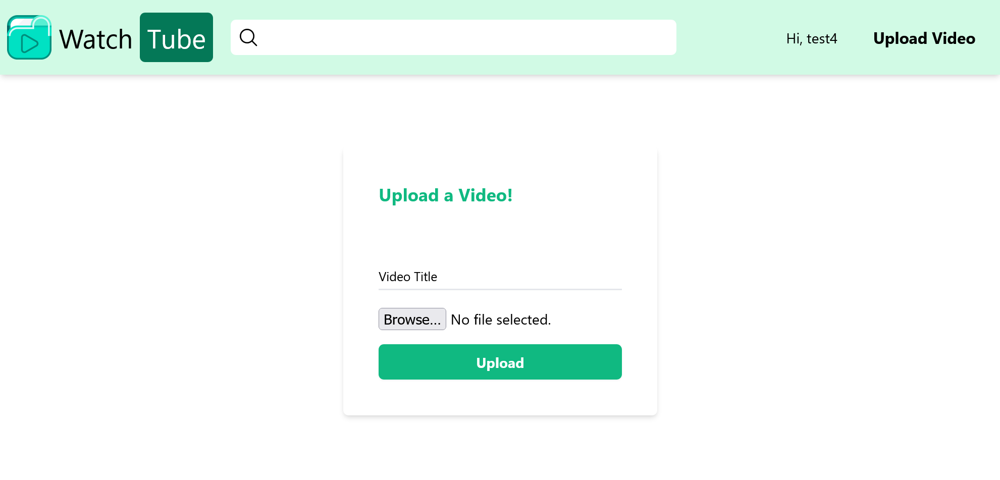
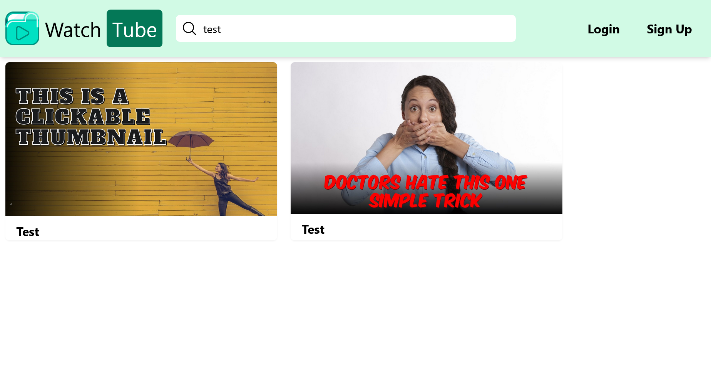
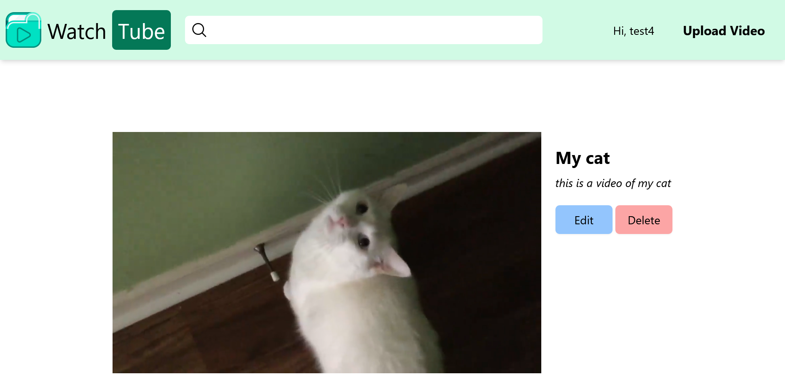

## MERN Stack Youtube Clone

---

This is a basic video sharing site. It includes a frontend, backend, and database.

Includes the following:

- registering and logging in users
- uploading videos
- watching videos
- editing titles and descriptions of owned videos
- deleting owned videos
- searching videos

This app tries to follow best practices, but as it is meant to be simple, some shortcuts were taken. There are comments mentioning most of those shortcuts, but some are omitted.

### Installation

1. run `npm i` in both `/server/` and `/client/` folders.
2. create a `.env` file in `/client/` that has the same lines as the `.env.example`
3. create a `.env` file in `/database/` that has the same lines as the `.env.example`
4. create a `development.env` and a `production.env` in the `/server/env/` folder that has the same lines as the `.env.example`
5. run `docker-compose up` in `/database/` folder.
   - it is also possible to use external MongoDB, or Atlas. Just update the .env file with the right data
6. run `npm run dev` in `/server/`.
7. run `npm run dev` in `/client/`.
8. go to `http://localhost:3001` or whichever port you chose to run the react page

### Screenshots

Main Page

Upload Video

Search Video

Watch and Edit Videos

